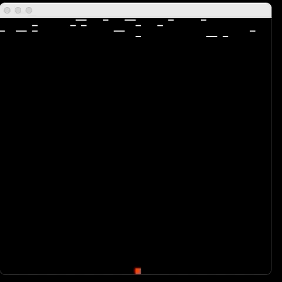

# Spaceship Game 
This is a small dodging game. User can control a spaceship left and right to dodging obstacles.
---
# Demo

---
# How to run game 
1. download the Game.jar file.
2. Type command in the terminal `$ java -jar Game.jar [window width] [window height] [speed] [obstacle level]`.
   For example: `$ java -jar Game.jar 500 500 7 3`. Speed: 1-9. Obstacle level: 1-9.
# Game Manual  
1. Press 'a': move spaceship left. 
2. Press 'd': move spaceship right. 
---
# Implementation Idea
Create a matrix which contains obstacles. All obstacles are invisible initially. When the 
game starts, obstacles are showed randomly row by row. The spaceship move around in the 2-D
matrix. If the spaceship's position shows that the obstacle with that index is visible, then
it is the collision.
---
# Problems I Had
Initially, the game was planned running on the terminal window. However, detecting keyboard became the problem because of
the way java handles the input in terminal. Therefore, Swing is used to make a fully functional game. 
---
# Improvements
1. Using a better way to update obstacles in the window instead of copy current row of obstacles status from 
previous row of obstacles.